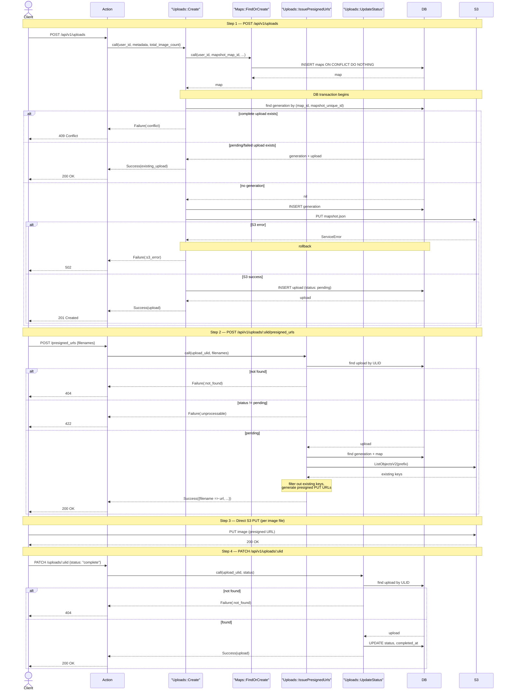

# Upload Flow

## S3 Key Structure

All files for a generation are stored under a per-user prefix:

```
{user_name}/{mapshot_map_id}/{mapshot_unique_id}/mapshot.json
{user_name}/{mapshot_map_id}/{mapshot_unique_id}/{surface_file_prefix}{zoom}/tile_{x}_{y}.jpg
```

Example (user `sakuro`, guest uploads use `guest`):
```
sakuro/ae8ec3ab/550f41a9/mapshot.json
sakuro/ae8ec3ab/550f41a9/s1zoom_4/tile_0_0.jpg
sakuro/ae8ec3ab/550f41a9/s1zoom_3/tile_0_0.jpg
```

The `metadata_s3_key` stored in DB points to `mapshot.json` within this prefix.

Avatar images use a separate prefix: `avatars/{user_id}/{ulid}.{ext}`

---

## Client-Side Flow

```
[picking]
  User clicks upload button
  → window.showDirectoryPicker()
  → Read selected directory root for mapshot.json
  → If not found: show error, return to idle

[confirming]
  → Parse mapshot.json (validate structure)
  → Enumerate all files in directory recursively
  → Separate: mapshot.json | image files
  → Show summary to user:
      - Map name (display_name resolution: name → savename → mapshot_map_id)
      - Surface count
      - Image file count
      - Total file size (sum of all image files)
  → User confirms

[uploading]
  Step 1: POST /api/v1/uploads
    Body: { metadata: <mapshot.json content>, total_image_count: N }
    → Receive: { ulid, map_ulid, generation_ulid }

  Step 2: POST /api/v1/uploads/:ulid/presigned_urls
    Body: { filenames: ["s1zoom_4/tile_0_0.jpg", ...] }  ← all filenames (server filters existing ones)
    → Receive: { presigned_urls: { filename: url, ... } }  ← only files that need uploading

  Step 3: Upload each image file returned in presigned_urls (parallel, with concurrency limit)
    → S3 PUT is atomic so success/failure per file is definitive
    → On individual file failure: retry the PUT for that file
    → On presigned URL expiry: re-call Step 2 with all filenames; server re-filters and reissues only what's needed

  Step 4: PATCH /api/v1/uploads/:ulid
    Body: { status: "complete" }

[done]
  → Show link to /@:userProfileName/maps/:map_ulid?generation=:generation_ulid
```

### Notes

- `mapshot.json` is sent in Step 1 body; the server writes it to S3 directly. The client does not request a presigned URL for it.
- File paths sent in Step 2 are relative paths within the selected directory (e.g. `s1zoom_4/tile_0_0.jpg`).
- Step 2 always receives the full filename list; the server filters out already-existing S3 keys via ListObjectsV2 (1 API call per request) and returns presigned URLs only for missing files.
- This makes both within-session retry and cross-session resume efficient — the client never needs to track which files were uploaded.
- If presigned URLs expire, re-call Step 2 with all filenames; the server re-filters and reissues only what is still needed.
- S3 PUT is atomic: each file either fully succeeds or fully fails. Partial writes do not occur.
- File System Access API (`showDirectoryPicker`) is supported in Chromium-based browsers only.

---

## Server-Side Processing

### POST /api/v1/uploads

1. Parse `metadata` field (mapshot.json content)
2. Extract `map_id` and `unique_id` from metadata
3. Identify the current user (guest user if no session)
4. Find or create `Map` by `(user_id, mapshot_map_id)` using `INSERT ... ON CONFLICT DO NOTHING`
   - A plain transaction is insufficient under `READ COMMITTED`: two concurrent requests can both find "not found" before either inserts
   - The upsert is atomic at the DB level; no transaction wrapper is needed for this step alone
5. Check if `Generation` with `(map_id, mapshot_unique_id)` already exists
   - If exists with a `complete` upload → return `409 Conflict`
   - If exists with a `pending`/`failed` upload → return the existing upload (allow retry)
   - If not exists → create `Generation`
6. Write mapshot.json to S3 at `{user_name}/{mapshot_map_id}/{mapshot_unique_id}/mapshot.json`
7. Set `metadata_s3_key` on the Generation record
8. Create `Upload` record (`status: pending`, `total_image_count` from request)
9. Return `{ ulid, map_ulid, generation_ulid }`

Steps 5–8 run inside a single transaction to ensure Generation, S3 write, and Upload are created atomically. Step 4 (map upsert) runs before this transaction; if the transaction rolls back (e.g. S3 failure), the Map record is retained — this is safe since Map creation is idempotent.

### POST /api/v1/uploads/:ulid/presigned_urls

1. Find `Upload` by ULID; return `404` if not found
2. Validate `status` is `pending`; return `422` if `complete` or `failed`
3. Call S3 ListObjectsV2 with prefix `{user_name}/{mapshot_map_id}/{mapshot_unique_id}/` to get existing keys (1 API call)
4. For each requested filename, skip if the corresponding S3 key already exists
5. Generate presigned PUT URL for each remaining (missing) key (expiry: configurable, default 1 hour)
6. Return `{ presigned_urls: { filename: url, ... } }` — contains only files that need uploading

### PATCH /api/v1/uploads/:ulid

1. Find `Upload` by ULID; return `404` if not found
2. Update `status` to `complete` (or `failed`)
3. Set `completed_at` to current time
4. Return updated upload record

---

## Operation Sequence



---

## S3 Configuration Requirements

- Bucket CORS policy must allow `PUT` from the application's frontend origin (for direct browser upload via presigned URL)
- CloudFront distribution serves the same bucket (read-only, public)

---

## Error Cases

| Scenario | Handling |
|---|---|
| Directory has no `mapshot.json` | Client-side validation; show error before upload starts |
| Generation already fully uploaded | Server returns `409 Conflict` |
| Generation upload previously failed | Upload remains `pending`; client re-calls Step 2 with remaining filenames and resumes |
| User re-opens browser after closing mid-upload | POST /uploads returns existing `pending` Upload; client re-requests presigned URLs for all files and re-uploads (S3 PUT is idempotent) |
| Presigned URLs expire mid-upload | Client re-calls Step 2 with remaining filenames only to reissue |
| Client closes browser during upload | Upload stays `pending`; resumable on next attempt (see above) |
| S3 write fails for `mapshot.json` | Server returns `502`; Generation and Upload records are rolled back |

### Resume design

Resume is handled server-side via S3 key filtering:

- The client always sends the full filename list to Step 2. The server calls S3 ListObjectsV2 and returns presigned URLs only for files not yet in S3.
- The client does not need to track which files were uploaded across sessions.
- On error, the Upload remains `pending` in the DB. On retry (same or different session), the client re-calls Step 2 with all filenames; the server automatically skips already-uploaded files.
- `failed` status is set only when the user explicitly abandons the upload (future: admin tooling). It is not required for the retry flow.
